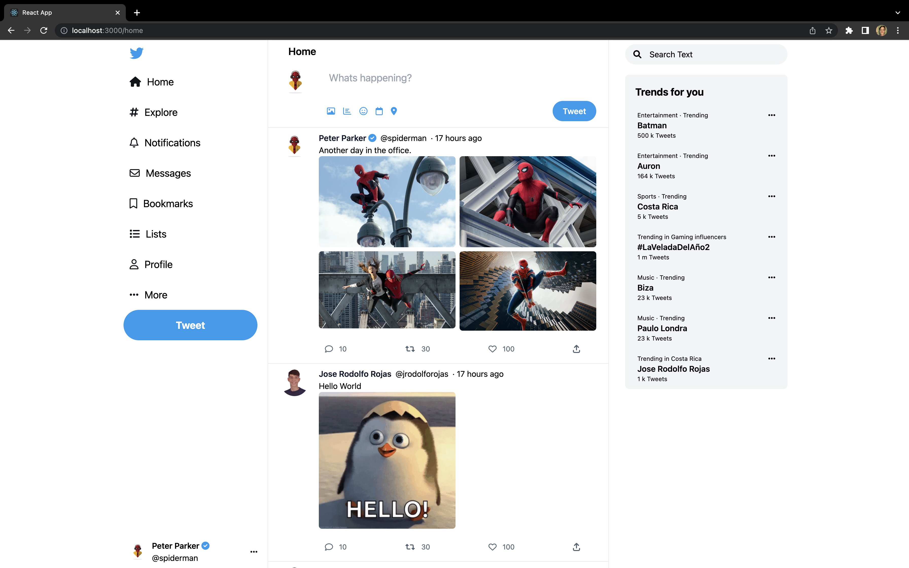
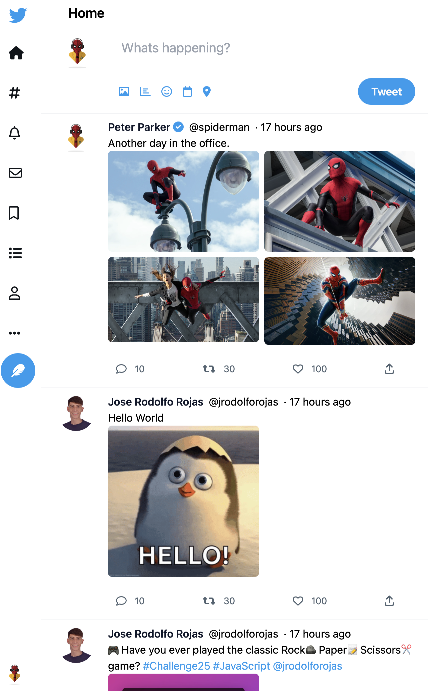
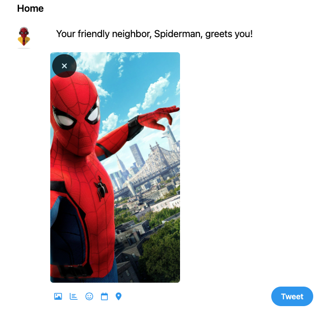

# Twitter Mirroring

## Demo
[Twitter Mirroring Demo](https://jrodolforojas.github.io/twitter-mirroring/)
## Screenshots
### Twitter Mirroring full width

### Twitter Mirroring (responsive design)

### Create Tweet example

## Instructions

You will have to create an application that represents as much as possible a fake Twitter timeline, showing
different types of tweets.

The more faithful to the original design, the better, although it's not necessary to display all current Twitter
functionalities. The aim of the challenge is focused on the ability to know how to create UI based on an existing
design.

The feed should display Tweets of the following types:

* Text tweet.
* Tweet with an image.
* Tweet with up to 4 images.
* Tweet with a GIF.

The data to be displayed doesn't have to be real. You can define your own mocked set of tweets, containing images,
texts, likes and so on.

Each Tweet should contain the following functionalities:

* Display the number of likes, retweets or comments.
* Represent hashtag or mentions (without filtering interaction).
* Represent links (with interaction and opening in a browser).
* User photo, name, date, tweet body and action buttons (without the profile edit feature)
* Up to you to choose other extra functionalities. For example:
    * Tweets with video or poll.
    * Tweets detail page, showing comments.
    * Image detail and zoom.
